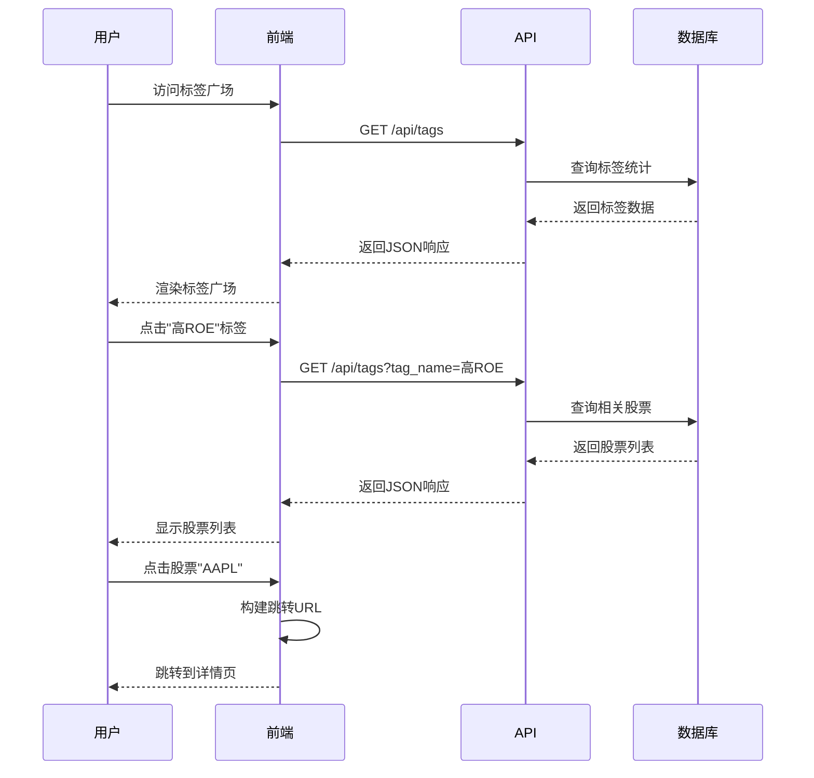
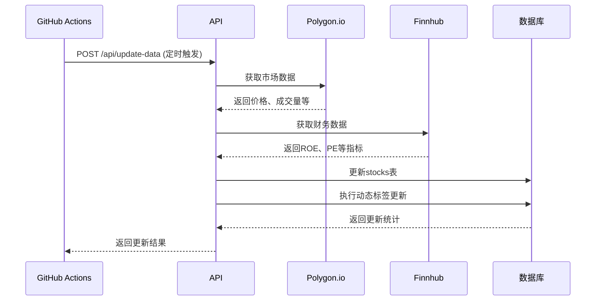

# Stock-Tag-Explorer 技术架构文档

## 📐 系统架构概览

### 整体架构设计

Stock-Tag-Explorer 采用现代化的三层架构设计，确保系统的可扩展性、可维护性和高性能。

```mermaid
graph TB
    subgraph "前端层 (Frontend Layer)"
        A[标签广场页面]
        B[股票列表组件]
        C[交互控制器]
    end
    
    subgraph "API服务层 (API Service Layer)"
        D[/api/tags]
        E[/api/update-data]
        F[数据验证中间件]
        G[错误处理中间件]
    end
    
    subgraph "数据层 (Data Layer)"
        H[(Neon Database)]
        I[数据访问层 DAL]
        J[缓存层 Redis]
    end
    
    subgraph "外部服务 (External Services)"
        K[Polygon.io API]
        L[Finnhub API]
        M[GitHub Actions]
    end
    
    A --> D
    B --> D
    C --> D
    D --> I
    E --> I
    E --> K
    E --> L
    I --> H
    I --> J
    M --> E
```

## 🏗️ 核心组件设计

### 1. 前端架构

#### 1.1 技术栈选择
- **框架**: Vanilla JavaScript + HTML5 + CSS3
- **构建工具**: Vite (可选，用于开发环境)
- **样式**: CSS Grid + Flexbox + CSS Variables
- **状态管理**: 原生 JavaScript 状态管理

#### 1.2 组件结构
```
src/
├── components/
│   ├── TagPlaza.js          # 标签广场主组件
│   ├── TagCard.js           # 单个标签卡片
│   ├── StockList.js         # 股票列表组件
│   ├── LoadingSpinner.js    # 加载状态组件
│   └── ErrorBoundary.js     # 错误边界组件
├── services/
│   ├── apiService.js        # API 调用服务
│   └── cacheService.js      # 前端缓存服务
├── utils/
│   ├── formatters.js        # 数据格式化工具
│   └── validators.js        # 数据验证工具
└── styles/
    ├── main.css            # 主样式文件
    ├── components.css      # 组件样式
    └── responsive.css      # 响应式样式
```

### 2. 后端架构

#### 2.1 API 设计原则
- **RESTful**: 遵循 REST 架构风格
- **版本控制**: API 版本化管理
- **错误处理**: 统一的错误响应格式
- **性能优化**: 数据缓存和查询优化

#### 2.2 API 端点详细设计

##### `/api/tags` 端点
```javascript
// 获取所有标签
GET /api/tags
Response: {
  "success": true,
  "data": [
    {
      "id": 1,
      "tag_name": "高ROE",
      "tag_type": "财务表现",
      "stock_count": 45,
      "description": "ROE > 15%的股票",
      "color": "#4CAF50",
      "icon": "trending_up"
    }
  ],
  "meta": {
    "total_tags": 25,
    "last_updated": "2024-01-15T10:30:00Z"
  }
}

// 获取特定标签的股票
GET /api/tags?tag_name=高ROE
Response: {
  "success": true,
  "tag_info": {
    "tag_name": "高ROE",
    "tag_type": "财务表现",
    "description": "ROE > 15%的股票"
  },
  "data": [
    {
      "ticker": "AAPL",
      "name_zh": "苹果公司",
      "name_en": "Apple Inc.",
      "current_price": 150.25,
      "change_percent": 2.34,
      "volume": 50000000,
      "market_cap": 2500000000000,
      "roe": 18.5
    }
  ],
  "meta": {
    "total_stocks": 45,
    "query_time": "2024-01-15T10:30:00Z"
  }
}
```

##### `/api/update-data` 端点
```javascript
// 数据更新端点
POST /api/update-data
Headers: {
  "Authorization": "Bearer ${CRON_SECRET}"
}

Response: {
  "success": true,
  "message": "数据更新完成",
  "stats": {
    "stocks_updated": 502,
    "tags_applied": 1250,
    "execution_time": "45.2s",
    "errors": 0
  },
  "timestamp": "2024-01-15T10:30:00Z"
}
```

### 3. 数据库设计

#### 3.1 表结构优化

```sql
-- 股票基础信息表
CREATE TABLE stocks (
    id SERIAL PRIMARY KEY,
    ticker VARCHAR(10) UNIQUE NOT NULL,
    name_en VARCHAR(255) NOT NULL,
    name_zh VARCHAR(255),
    sector VARCHAR(100),
    industry VARCHAR(100),
    
    -- 市场数据
    current_price DECIMAL(12,4),
    change_percent DECIMAL(8,4),
    volume BIGINT,
    market_cap BIGINT,
    
    -- 财务指标
    pe_ratio DECIMAL(8,2),
    roe DECIMAL(8,4),
    debt_to_equity DECIMAL(8,4),
    revenue_growth DECIMAL(8,4),
    
    -- 元数据
    is_sp500 BOOLEAN DEFAULT false,
    is_active BOOLEAN DEFAULT true,
    created_at TIMESTAMP DEFAULT CURRENT_TIMESTAMP,
    updated_at TIMESTAMP DEFAULT CURRENT_TIMESTAMP
);

-- 创建索引优化查询性能
CREATE INDEX idx_stocks_ticker ON stocks(ticker);
CREATE INDEX idx_stocks_sector ON stocks(sector);
CREATE INDEX idx_stocks_market_cap ON stocks(market_cap);
CREATE INDEX idx_stocks_updated_at ON stocks(updated_at);

-- 标签定义表
CREATE TABLE tags (
    id SERIAL PRIMARY KEY,
    tag_name VARCHAR(100) UNIQUE NOT NULL,
    tag_type VARCHAR(50) NOT NULL,
    description TEXT,
    color VARCHAR(7) DEFAULT '#2196F3',
    icon VARCHAR(50),
    
    -- 标签配置
    is_dynamic BOOLEAN DEFAULT false,
    update_rule JSONB, -- 动态标签的更新规则
    display_order INTEGER DEFAULT 0,
    is_active BOOLEAN DEFAULT true,
    
    created_at TIMESTAMP DEFAULT CURRENT_TIMESTAMP,
    updated_at TIMESTAMP DEFAULT CURRENT_TIMESTAMP
);

CREATE INDEX idx_tags_type ON tags(tag_type);
CREATE INDEX idx_tags_dynamic ON tags(is_dynamic);

-- 股票标签关联表
CREATE TABLE stock_tags (
    id SERIAL PRIMARY KEY,
    stock_id INTEGER REFERENCES stocks(id) ON DELETE CASCADE,
    tag_id INTEGER REFERENCES tags(id) ON DELETE CASCADE,
    
    -- 关联元数据
    confidence_score DECIMAL(3,2) DEFAULT 1.0, -- 标签置信度
    applied_at TIMESTAMP DEFAULT CURRENT_TIMESTAMP,
    
    UNIQUE(stock_id, tag_id)
);

CREATE INDEX idx_stock_tags_stock ON stock_tags(stock_id);
CREATE INDEX idx_stock_tags_tag ON stock_tags(tag_id);
CREATE INDEX idx_stock_tags_applied ON stock_tags(applied_at);
```

#### 3.2 数据更新策略

```sql
-- 创建视图简化查询
CREATE VIEW v_tag_stats AS
SELECT 
    t.id,
    t.tag_name,
    t.tag_type,
    t.description,
    t.color,
    t.icon,
    COUNT(st.stock_id) as stock_count,
    t.display_order
FROM tags t
LEFT JOIN stock_tags st ON t.id = st.tag_id
WHERE t.is_active = true
GROUP BY t.id, t.tag_name, t.tag_type, t.description, t.color, t.icon, t.display_order
ORDER BY t.display_order, t.tag_name;

-- 创建函数用于动态标签更新
CREATE OR REPLACE FUNCTION update_dynamic_tags()
RETURNS void AS $$
BEGIN
    -- 清除旧的动态标签
    DELETE FROM stock_tags 
    WHERE tag_id IN (SELECT id FROM tags WHERE is_dynamic = true);
    
    -- 应用高ROE标签 (ROE > 15%)
    INSERT INTO stock_tags (stock_id, tag_id)
    SELECT s.id, t.id
    FROM stocks s, tags t
    WHERE s.roe > 15.0 
    AND t.tag_name = '高ROE'
    AND s.is_active = true;
    
    -- 应用其他动态标签...
    -- (根据具体业务规则添加)
    
END;
$$ LANGUAGE plpgsql;
```

## 🔄 数据流设计

### 1. 用户交互流程



### 2. 数据更新流程



## 🚀 性能优化策略

### 1. 前端优化
- **懒加载**: 股票列表分页加载
- **缓存策略**: 标签数据本地缓存30分钟
- **防抖处理**: 搜索输入防抖优化
- **图片优化**: 使用 WebP 格式和适当尺寸

### 2. 后端优化
- **数据库索引**: 关键字段建立复合索引
- **查询优化**: 使用视图和存储过程
- **连接池**: 数据库连接池管理
- **缓存层**: Redis 缓存热点数据

### 3. 部署优化
- **CDN**: 静态资源 CDN 加速
- **压缩**: Gzip 压缩响应数据
- **HTTP/2**: 启用 HTTP/2 协议
- **缓存头**: 合理设置缓存策略

## 🔒 安全架构

### 1. API 安全
```javascript
// 环境变量配置
const config = {
  POLYGON_API_KEY: process.env.POLYGON_API_KEY,
  FINNHUB_API_KEY: process.env.FINNHUB_API_KEY,
  CRON_SECRET: process.env.CRON_SECRET,
  DATABASE_URL: process.env.DATABASE_URL
};

// API 密钥验证中间件
function validateCronSecret(req, res, next) {
  const authHeader = req.headers.authorization;
  if (!authHeader || authHeader !== `Bearer ${config.CRON_SECRET}`) {
    return res.status(401).json({ error: 'Unauthorized' });
  }
  next();
}
```

### 2. 数据安全
- **输入验证**: 严格的参数验证
- **SQL注入防护**: 使用参数化查询
- **XSS防护**: 输出数据转义
- **CORS配置**: 合理的跨域策略

## 📊 监控与日志

### 1. 性能监控
- **响应时间**: API 响应时间监控
- **错误率**: 错误请求比例监控
- **数据库性能**: 查询执行时间监控
- **用户行为**: 页面访问和交互统计

### 2. 日志策略
```javascript
// 日志配置
const logger = {
  info: (message, meta) => {
    console.log(JSON.stringify({
      level: 'info',
      message,
      meta,
      timestamp: new Date().toISOString()
    }));
  },
  error: (message, error) => {
    console.error(JSON.stringify({
      level: 'error',
      message,
      error: error.message,
      stack: error.stack,
      timestamp: new Date().toISOString()
    }));
  }
};
```

---

本架构文档将随着系统演进持续更新，确保技术实现与业务需求保持一致。