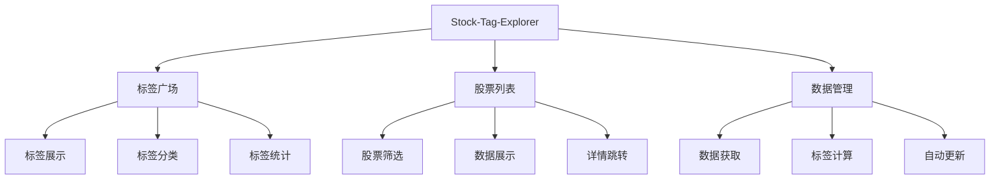

# 产品需求文档 (PRD)
# Stock-Tag-Explorer - 智能标签浏览器

---

**文档版本**: v1.0  
**项目代号**: StockLink - Phase 1 Module C: The Neural Network  
**产品经理**: PM-Core  
**创建日期**: 2024年1月  
**最后更新**: 2024年1月  

---

## 📋 文档概览

### 文档目的
本PRD旨在为Stock-Tag-Explorer项目提供完整的产品需求规范，确保开发团队、设计团队和业务团队对产品目标、功能需求和实现路径达成一致。

### 目标读者
- 产品开发团队
- 前端/后端工程师
- UI/UX设计师
- 项目管理者
- 业务决策者

---

## 🎯 产品战略

### 1.1 产品愿景

**愿景声明**:  
Stock-Tag-Explorer 致力于成为北美华人投资者的智能股票发现引擎，通过创新的标签体系将复杂的股票数据转化为直观、可操作的投资洞察。

**使命**:  
为投资者提供一个基于多维度标签的股票筛选和发现平台，帮助用户快速识别符合特定投资策略和风险偏好的股票集群。

### 1.2 市场定位

**目标市场**: 北美华人投资群体  
**市场规模**: 约300万潜在用户  
**竞争优势**: 
- 中文本土化体验
- 智能标签分类系统
- 实时数据驱动
- 与详情页无缝集成

### 1.3 产品定位

在StockLink平台"三驾马车"战略中，Stock-Tag-Explorer扮演**数据发现引擎**的角色：

```
┌─────────────────┐    ┌─────────────────┐    ┌─────────────────┐
│   热力图模块     │    │   标签浏览器     │    │   个股详情页     │
│  (市场概览)     │◄──►│  (数据发现)     │◄──►│  (深度分析)     │
│                │    │                │    │                │
│ • 市场全景      │    │ • 智能标签      │    │ • 详细数据      │
│ • 热点追踪      │    │ • 股票筛选      │    │ • 技术分析      │
│ • 趋势识别      │    │ • 集群发现      │    │ • 基本面分析    │
└─────────────────┘    └─────────────────┘    └─────────────────┘
```

---

## 👥 用户研究

### 2.1 目标用户画像

#### 主要用户群体 (Primary Persona)

**张先生 - 资深投资者**
- **年龄**: 35-45岁
- **职业**: 科技公司高管
- **投资经验**: 5-10年
- **投资规模**: $50K - $500K
- **痛点**: 
  - 信息过载，难以快速筛选优质股票
  - 英文财务报告理解困难
  - 缺乏系统化的投资决策工具
- **需求**: 
  - 快速发现符合投资策略的股票
  - 中文化的数据展示
  - 基于财务指标的智能分类

#### 次要用户群体 (Secondary Persona)

**李女士 - 投资新手**
- **年龄**: 25-35岁
- **职业**: 金融/咨询行业
- **投资经验**: 1-3年
- **投资规模**: $10K - $50K
- **痛点**: 
  - 不知道如何选择股票
  - 对财务指标理解有限
  - 需要学习投资知识
- **需求**: 
  - 简单易懂的股票分类
  - 投资教育内容
  - 风险提示和建议

### 2.2 用户需求分析

#### 核心需求 (Must Have)
1. **快速股票发现**: 通过标签快速找到符合条件的股票
2. **中文化体验**: 所有界面和数据以中文展示
3. **实时数据**: 股票价格和财务数据实时更新
4. **无缝跳转**: 一键跳转到详细分析页面

#### 期望需求 (Should Have)
1. **智能推荐**: 基于用户行为的个性化推荐
2. **自定义标签**: 用户可创建个人标签
3. **数据导出**: 支持股票列表导出
4. **移动端适配**: 响应式设计支持移动设备

#### 增值需求 (Could Have)
1. **社交功能**: 用户可分享标签和股票列表
2. **投资组合**: 构建和跟踪投资组合
3. **预警功能**: 股票价格和指标变化提醒
4. **历史回测**: 标签策略的历史表现分析

---

## 🎨 产品功能规格

### 3.1 功能架构图



### 3.2 核心功能详述

#### 3.2.1 标签广场 (Tag Plaza)

**功能描述**:  
标签广场是用户的主要入口，展示所有可用的股票标签，按类型分组显示。

**功能需求**:

| 需求ID | 功能点 | 详细描述 | 优先级 |
|--------|--------|----------|--------|
| F001 | 标签展示 | 以卡片形式展示所有标签，包含标签名称、类型、股票数量 | P0 |
| F002 | 标签分组 | 按标签类型分组展示：财务表现、市场表现、行业分类等 | P0 |
| F003 | 标签统计 | 实时显示每个标签关联的股票数量 | P0 |
| F004 | 加载状态 | 显示数据加载进度和状态 | P1 |
| F005 | 错误处理 | 网络错误时显示友好的错误信息和重试选项 | P1 |

**标签分类体系**:

1. **财务表现标签**
   - 高ROE (ROE > 15%)
   - 高增长 (营收增长 > 20%)
   - 低负债 (负债权益比 < 0.3)
   - 高分红 (股息率 > 3%)

2. **市场表现标签**
   - 强势股 (近30日涨幅 > 10%)
   - 抗跌股 (近30日跌幅 < 5%)
   - 高成交量 (成交量 > 平均值2倍)
   - 突破新高 (价格创52周新高)

3. **行业分类标签**
   - 科技股
   - 医疗保健
   - 金融服务
   - 消费品
   - 能源

4. **特殊名单标签**
   - 标普500成分股
   - 纳斯达克100
   - 道琼斯成分股
   - ESG优选

**交互规范**:
- 标签卡片支持悬停效果
- 点击标签后高亮显示选中状态
- 平滑滚动到股票列表区域
- 支持键盘导航

#### 3.2.2 股票列表 (Stock List)

**功能描述**:  
根据选中的标签动态展示相关股票列表，提供关键信息和快速跳转功能。

**功能需求**:

| 需求ID | 功能点 | 详细描述 | 优先级 |
|--------|--------|----------|--------|
| F006 | 股票筛选 | 根据选中标签筛选并展示相关股票 | P0 |
| F007 | 信息展示 | 显示股票中文名、代码、当前价格、涨跌幅 | P0 |
| F008 | 详情跳转 | 点击股票跳转到详情页面 | P0 |
| F009 | 排序功能 | 支持按市值、涨跌幅、价格等排序 | P1 |
| F010 | 分页加载 | 大量数据时支持分页或无限滚动 | P1 |

**数据展示规范**:

```
┌─────────────────────────────────────────────────────┐
│ 苹果公司 (AAPL)                    $150.25  +2.34% │
│ 微软公司 (MSFT)                    $280.10  +1.85% │
│ 谷歌公司 (GOOGL)                   $125.50  -0.95% │
└─────────────────────────────────────────────────────┘
```

**跳转链接格式**:
```
https://stock-details-final.vercel.app/?symbol=[TICKER]
```

#### 3.2.3 数据管理系统

**功能描述**:  
后台数据管理系统，负责从外部API获取数据、计算标签、更新数据库。

**功能需求**:

| 需求ID | 功能点 | 详细描述 | 优先级 |
|--------|--------|----------|--------|
| F011 | 数据获取 | 从Polygon.io和Finnhub获取股票数据 | P0 |
| F012 | 标签计算 | 根据预设规则计算并应用动态标签 | P0 |
| F013 | 自动更新 | 通过GitHub Actions定时更新数据 | P0 |
| F014 | 错误监控 | 监控数据更新过程中的错误 | P1 |
| F015 | 性能优化 | 批量处理和缓存机制 | P1 |

---

## 🔧 技术需求

### 4.1 技术架构

**前端技术栈**:
- HTML5 + CSS3 + Vanilla JavaScript
- 响应式设计 (CSS Grid + Flexbox)
- 现代浏览器兼容 (Chrome 80+, Firefox 75+, Safari 13+)

**后端技术栈**:
- Node.js + Vercel Serverless Functions
- PostgreSQL (Neon Database)
- RESTful API 设计

**外部服务集成**:
- Polygon.io (股票市场数据)
- Finnhub (财务指标数据)
- GitHub Actions (自动化任务)

### 4.2 数据库设计

#### 核心表结构

**stocks 表**:
```sql
CREATE TABLE stocks (
    id SERIAL PRIMARY KEY,
    ticker VARCHAR(10) UNIQUE NOT NULL,
    name_en VARCHAR(255) NOT NULL,
    name_zh VARCHAR(255),
    sector VARCHAR(100),
    current_price DECIMAL(12,4),
    change_percent DECIMAL(8,4),
    volume BIGINT,
    market_cap BIGINT,
    pe_ratio DECIMAL(8,2),
    roe DECIMAL(8,4),
    updated_at TIMESTAMP DEFAULT CURRENT_TIMESTAMP
);
```

**tags 表**:
```sql
CREATE TABLE tags (
    id SERIAL PRIMARY KEY,
    tag_name VARCHAR(100) UNIQUE NOT NULL,
    tag_type VARCHAR(50) NOT NULL,
    description TEXT,
    is_dynamic BOOLEAN DEFAULT false,
    display_order INTEGER DEFAULT 0
);
```

**stock_tags 表**:
```sql
CREATE TABLE stock_tags (
    id SERIAL PRIMARY KEY,
    stock_id INTEGER REFERENCES stocks(id),
    tag_id INTEGER REFERENCES tags(id),
    applied_at TIMESTAMP DEFAULT CURRENT_TIMESTAMP,
    UNIQUE(stock_id, tag_id)
);
```

### 4.3 API 设计

#### 4.3.1 GET /api/tags

**用途**: 获取标签列表或特定标签的股票

**请求参数**:
- `tag_name` (可选): 特定标签名称

**响应格式**:
```json
{
  "success": true,
  "data": [
    {
      "id": 1,
      "tag_name": "高ROE",
      "tag_type": "财务表现",
      "stock_count": 45,
      "description": "ROE > 15%的股票"
    }
  ],
  "meta": {
    "total_tags": 25,
    "last_updated": "2024-01-15T10:30:00Z"
  }
}
```

#### 4.3.2 POST /api/update-data

**用途**: 更新股票数据和标签

**认证**: Bearer Token (CRON_SECRET)

**响应格式**:
```json
{
  "success": true,
  "message": "数据更新完成",
  "stats": {
    "stocks_updated": 502,
    "tags_applied": 1250,
    "execution_time": "45.2s"
  }
}
```

---

## 📊 性能需求

### 5.1 性能指标

| 指标 | 目标值 | 测量方法 |
|------|--------|----------|
| 页面首次加载时间 | < 3秒 | Lighthouse |
| API 响应时间 | < 500ms | 服务器日志 |
| 数据库查询时间 | < 200ms | 查询分析 |
| 并发用户支持 | 1000+ | 压力测试 |
| 可用性 | 99.5% | 监控系统 |

### 5.2 优化策略

**前端优化**:
- 资源压缩和合并
- 图片懒加载
- 浏览器缓存策略
- CDN 加速

**后端优化**:
- 数据库索引优化
- 查询结果缓存
- 连接池管理
- API 限流

---

## 🔒 安全需求

### 6.1 数据安全

**敏感信息保护**:
- API 密钥通过环境变量管理
- 数据库连接加密
- 用户输入验证和过滤

**访问控制**:
- CORS 策略配置
- API 访问频率限制
- 后台管理接口认证

### 6.2 隐私保护

**数据收集**:
- 仅收集必要的使用统计
- 不收集个人身份信息
- 遵循GDPR和CCPA规范

---

## 🚀 发布计划

### 7.1 开发里程碑

#### M1: 后端就绪 (Week 1-2)
- [ ] 数据库设计和初始化
- [ ] API 接口开发
- [ ] 外部数据源集成
- [ ] 自动化数据更新
- [ ] 单元测试覆盖

**验收标准**:
- 所有API接口正常响应
- 数据更新任务成功执行
- 测试覆盖率 > 80%

#### M2: 前端上线 (Week 3-4)
- [ ] 标签广场页面开发
- [ ] 股票列表功能实现
- [ ] 响应式设计适配
- [ ] 错误处理和加载状态
- [ ] 跨浏览器兼容性测试

**验收标准**:
- 所有核心功能正常工作
- 移动端体验良好
- 页面加载时间 < 3秒

#### M3: 正式发布 (Week 5-6)
- [ ] 端到端测试
- [ ] 性能优化
- [ ] 安全审查
- [ ] 生产环境部署
- [ ] 监控和告警配置

**验收标准**:
- 所有测试用例通过
- 性能指标达标
- 安全扫描无高危漏洞

### 7.2 发布策略

**灰度发布**:
1. 内部测试 (开发团队)
2. Alpha 测试 (内部用户)
3. Beta 测试 (邀请用户)
4. 正式发布 (全量用户)

**回滚计划**:
- 保留前一版本的完整备份
- 数据库迁移脚本可逆
- 快速回滚机制 (< 5分钟)

---

## 📈 成功指标

### 8.1 业务指标

| 指标 | 目标值 | 测量周期 |
|------|--------|----------|
| 日活跃用户 (DAU) | 500+ | 每日 |
| 用户留存率 (7日) | 40%+ | 每周 |
| 标签点击率 | 60%+ | 每日 |
| 详情页跳转率 | 25%+ | 每日 |
| 页面停留时间 | 2分钟+ | 每日 |

### 8.2 技术指标

| 指标 | 目标值 | 测量周期 |
|------|--------|----------|
| 系统可用性 | 99.5%+ | 每月 |
| API 错误率 | < 1% | 每日 |
| 平均响应时间 | < 500ms | 每小时 |
| 数据更新成功率 | 99%+ | 每日 |

### 8.3 用户体验指标

| 指标 | 目标值 | 测量方法 |
|------|--------|----------|
| 用户满意度 | 4.0+/5.0 | 用户调研 |
| 任务完成率 | 85%+ | 用户测试 |
| 首次使用成功率 | 90%+ | 用户行为分析 |

---

## 🔄 后续迭代规划

### V1.1 功能增强 (Q2 2024)
- 个性化推荐算法
- 自定义标签功能
- 高级筛选器
- 数据导出功能

### V1.2 移动端优化 (Q3 2024)
- 原生移动应用
- 离线数据缓存
- 推送通知
- 手势操作优化

### V2.0 智能化升级 (Q4 2024)
- AI 驱动的标签生成
- 智能投资建议
- 风险评估模型
- 社交功能集成

---

## 📝 附录

### A. 竞品分析

**主要竞品**:
1. **Finviz**: 功能强大但界面复杂，缺乏中文支持
2. **TradingView**: 专业工具，学习成本高
3. **Yahoo Finance**: 数据全面但筛选功能有限

**竞争优势**:
- 中文本土化体验
- 简洁直观的标签系统
- 与详情页深度集成
- 针对华人投资习惯优化

### B. 风险评估

**技术风险**:
- 外部API限制和稳定性
- 数据库性能瓶颈
- 第三方服务依赖

**业务风险**:
- 用户接受度不确定
- 竞品功能追赶
- 监管政策变化

**缓解措施**:
- 多数据源备份方案
- 性能监控和优化
- 用户反馈快速响应

### C. 术语表

| 术语 | 定义 |
|------|------|
| 标签 | 基于特定规则对股票进行分类的标识符 |
| 动态标签 | 根据实时数据自动计算和更新的标签 |
| 静态标签 | 基于固定属性的标签，如行业分类 |
| ROE | 净资产收益率，衡量公司盈利能力的指标 |
| PE比率 | 市盈率，股价与每股收益的比值 |

---

**文档状态**: ✅ 已完成  
**下次评审**: 开发启动前  
**批准人**: 产品负责人  
**版本控制**: Git 版本管理  

---

*本PRD将根据项目进展和用户反馈持续更新，确保产品开发始终与业务目标保持一致。*